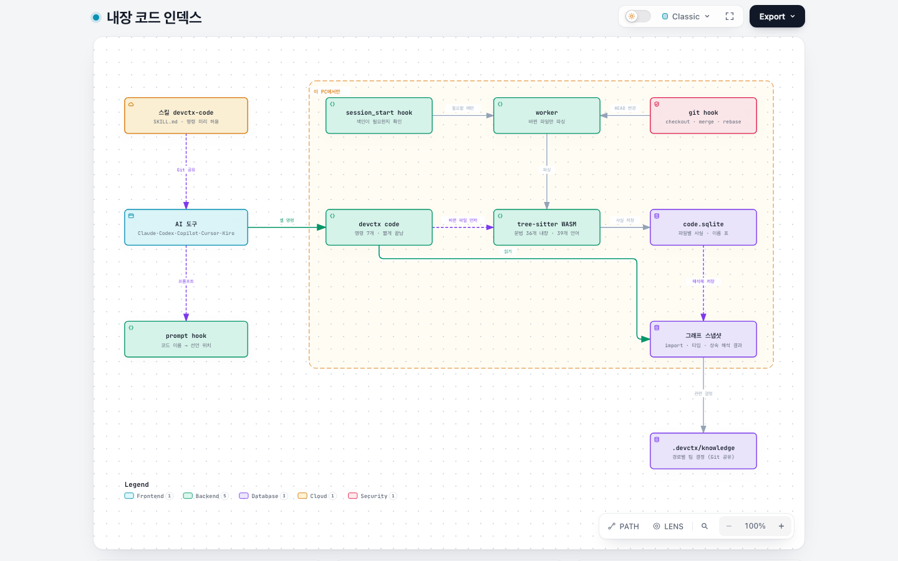

# devctx 동작 방식

devctx는 AI 도구와 나눈 대화에서 프로젝트 결정을 골라 Git에 파일로 남기고, 그 결정을 모든 AI 도구에 다시 전달한다. 코드 구조는 내장 코드 인덱스가 그래프로 만들어 AI가 파일을 통째로 읽지 않고 찾게 한다. 사용자가 따로 할 일은 없다.

그림은 [Archify](https://github.com/tt-a1i/archify)로 만들었다. 이미지를 누르면 인터랙티브 HTML이 열린다. GitHub에서는 HTML이 소스로 보이니 clone한 뒤 브라우저로 연다. HTML에서는 단계별 보기(Guided views), 경로 추적, 확대, 라이트/다크 전환, PNG·SVG 내보내기를 쓸 수 있고, 뷰어 메뉴는 영어다.

```sh
open docs/diagrams/architecture.html   # macOS
```

## 1. 한눈에 보기

[](diagrams/architecture.html)

| 단계 | 하는 일 | 위치 |
|---|---|---|
| 캡처 | AI 도구의 hook이 프롬프트와 턴 종료를 기록한다 | 이 PC (`.devctx/local/`, git 제외) |
| 정리 | 백그라운드 worker가 규칙을 추출하고 기존 결정과 비교해 파일을 추가하거나 대체한다 | 이 PC |
| 전달 | 결정을 AGENTS.md와 도구별 규칙 파일로 만들고, 프롬프트마다 관련 결정을 hook으로 붙인다 | 저장소 |
| 공유 | 결정 파일이 사용자 커밋에 함께 실려 clone한 팀원에게도 적용된다 | Git |

## 2. 대화 한 턴에서 일어나는 일

[](diagrams/turn-sequence.html)

1. 개발자가 평소처럼 말한다. 예: "앞으로 금액은 Long으로 해"
2. `UserPromptSubmit` hook이 프롬프트를 기록하고, 관련 결정이 있으면 600토큰 이내로 붙인다. hook은 약 0.1초 만에 끝나고 실패해도 AI 도구를 막지 않는다.
3. 턴이 끝나면(`Stop`) hook이 worker를 분리된 프로세스로 띄운다.
4. worker가 작업 중인 도구의 CLI로 규칙을 추출하고, 비슷한 기존 결정과 비교(판정)한다.
5. 판정 결과대로 결정 파일을 추가·보강·대체하고 AGENTS.md를 다시 만든다.
6. 다음 세션부터 모든 도구가 바뀐 결정을 읽는다.

프롬프트에 붙일 결정은 LLM 없이 고른다.

- 점수는 단어 겹침(모든 결정에 흔한 "사용한다" 같은 단어는 낮게 치는 IDF 가중치), 결정의 주제어, 프롬프트에 나온 파일 경로, 프롬프트에 나온 코드 이름이 선언된 파일(코드 인덱스)을 더한다. "OrderService 고쳐줘"만으로도 `src/billing/**` 규칙이 붙는다.
- 프롬프트가 구체적인 파일을 가리키는데 결정의 경로 범위 밖이면 뺀다. `packages/api` 규칙은 `packages/web` 작업에 붙지 않는다.
- 대체됐거나 기한이 지난 결정, 이 세션에 이미 붙인 결정은 붙이지 않는다. 예산에 안 맞는 긴 결정은 건너뛰고 다음 결정을 계속 넣는다.
- 슬래시 명령(`/compact`), 셸 명령(`!ls`), "응"·"continue" 같은 짧은 대답에는 관련 결정을 찾지 않는다.
- `devctx why "<프롬프트>"`가 같은 계산을 보여준다: 결정별 점수 구성, 붙은 것과 빠진 이유(기준 미달, 예산 초과, 이미 붙임, AGENTS.md에 이미 있음).

새 세션의 첫 요청 세 개 중 하나가 직전 작업을 이어가는 말("이어서", "아까 하던 거", "continue")이거나 직전 세션과 같은 코드 이름·파일을 담으면, 이 worktree의 직전 세션(다른 도구였어도)의 마지막 요청 두 개와 마지막 응답 앞부분을 300토큰 이내로 한 번 붙인다. 7일 넘은 세션, 대화가 압축·재개된 세션에는 붙이지 않는다. 마지막 응답은 도구가 턴 종료 hook에 응답을 넘겨줄 때만 있다.

## 3. 결정의 상태

[](diagrams/decision-lifecycle.html)

| 상태 | 뜻 | 이렇게 된다 |
|---|---|---|
| `active` | 모든 도구에 전달된다 | "앞으로", "항상" 같은 명확한 지시, 또는 확인 대기가 다시 언급될 때 |
| `proposed` | 확인을 기다린다. 전달하지 않고, 이 PC(`.devctx/local/`)에만 있다 | 계속 지킬 규칙인지 애매한 지시 |
| 보관 | 확인 대기가 30일 동안 다시 나오지 않음. 지우지 않고 이 PC에 남는다 | 몇 달 뒤라도 다시 말하면 바로 `active` |
| `conflict` | 부딪힌 채로 남는다 | 다른 사람이 정한 규칙과 반대되는 지시, 또는 두 사람이 같은 규칙을 서로 다르게 대체했을 때. 관련 작업을 할 때 AI가 한 번 묻는다 |
| `superseded` | 기록만 남는다 | 더 새로운 결정 파일이 `supersedes`로 가리킬 때 (정책 변경, 보강, 충돌 정리) |
| `retired` | 만료 | 기한(`valid_until`)이 지났을 때 |

**devctx는 한 번 만든 결정 파일을 다시 고치지 않는다.** 바꿀 일이 생기면 새 파일을 만든다.

| 일 | 새 파일에 적는 것 | 이전 파일 |
|---|---|---|
| 대체, 보강(예외 추가), 기한 변경, 충돌 정리 | `supersedes: [이전 id]` | 그대로 둔다. 읽을 때 `superseded`로 계산 |
| 다른 사람 규칙과 반대 | `conflict_with: [상대 id]` | 그대로 둔다. 둘 다 `conflict`로 계산 |
| 대체된 규칙에 기대던 규칙 | `review: [id]` | 그대로 둔다. "확인 필요"로 계산 |
| 같은 말 반복, AI가 어긴 횟수 | 파일 없음. 이 PC의 `state.sqlite`에 센다 | 그대로 둔다 |

상태는 모든 파일을 함께 읽고 계산한다. 더 새로운 파일이 가리킬 때만 대체되므로 순환이 생기지 않는다. 순서는 파일에 적힌 기록 시각(없으면 ULID id의 시각)으로 정해서 PC마다 같다. 파일 수정 시각은 쓰지 않는다.

기한은 사용자가 끝나는 날을 말했을 때만 저장한다("10월 10일 릴리스 전까지", "이번 달 말까지"는 메시지를 쓴 날 기준으로 날짜를 정한다). 날짜로 계산하므로 다음 날부터 바로 빠지고, 다음 세션 때 worker가 AGENTS.md와 경로 규칙 파일을 다시 만든다.

### 여러 사람과 병합

- 결정 파일은 새로 추가만 하니 두 사람의 변경이 같은 파일에 닿지 않는다. 병합 충돌은 사람이 같은 파일을 직접 고쳤을 때만 난다.
- AGENTS.md와 도구별 규칙 파일은 `.gitattributes`의 `merge=union`(git 기본 기능, PC별 설정 불필요)으로 양쪽 줄을 합치고, post-merge·post-rewrite hook이 합쳐진 결정으로 다시 만든다. AGENTS.md는 Git에 있는 파일(결정과 코드)만으로 만들어서, 새로 clone한 PC도 바이트까지 같은 결과를 낸다.
- 같은 규칙을 두 사람이 서로 다르게 대체했으면(A는 Jest→Vitest, B는 Jest→Kotest) 두 새 규칙이 충돌이 된다. B의 지시가 A의 규칙과 반대라서 대체가 아닌 충돌(`conflict_with: [Jest]`)로 기록됐어도, 병합 뒤 Jest가 이미 Vitest로 대체돼 있으면 충돌은 Vitest로 옮겨간다. 어느 쪽으로 정하든 새 파일 하나가 양쪽을 모두 대체한다. 같은 문장이 두 번 기록됐으면 오래된 쪽 하나만 전달하고, 그 원본이 대체됐으면 사본도 같이 대체된다.
- 병합으로 들어온 팀원의 AGENTS.md 줄은 사람이 직접 고친 것으로 보지 않는다. 지금 결정으로 다시 만들면 나오는 줄, 알려진 결정의 문장, 제목, devctx 안내 문장을 뺀 나머지만 직접 수정으로 본다.

### 코드 근거

결정 파일을 만들 때 그 규칙이 기대는 것을 `anchors`에 적는다.

- 규칙에 나온 이름 중 저장소가 실제로 쓰는 의존성·도구: `package.json`, `composer.json`, `pyproject.toml`, `requirements*.txt`, `go.mod`, `Cargo.toml`, Gradle·Maven 파일, `Gemfile`의 의존성, lockfile로 본 패키지 매니저, `jest.config.*`·`vite.config.*` 같은 설정 파일로 본 도구.
- "Jest 대신 Vitest", "npm 말고", "never use X"처럼 그만 쓰라는 이름은 적지 않는다.
- 규칙의 경로 범위 중 실제로 파일이 있는 것.

compile(worker, git hook)할 때 `git ls-files`로 본 파일과 비교해서 적어둔 것이 사라졌으면, 규칙을 지우지 않고 "확인 필요: 저장소에서 `jest`을(를) 찾을 수 없음"을 붙여 AGENTS.md 항상 읽는 목록에서 내린다. 관련 작업 때는 표시와 함께 전달되어 AI가 확인한다. 다시 생기면 표시도 없어진다. `tier: core`로 고정한 규칙은 내리지 않는다. Git 색인만 보고 LLM 없이 판단해서 같은 커밋이면 모든 PC가 같은 결과를 낸다. 이 기능이 생기기 전에 만든 결정 파일에는 `anchors`가 없어서 확인하지 않는다.

### 스스로 알리기

| 무엇 | 언제 | 어디로 |
|---|---|---|
| 규칙 추출이 3번 연속 실패 (CLI 변경, 로그인 만료 등) | 다음 세션 시작, 하루 한 번 | 세션 컨텍스트: AI가 사용자에게 한 번 알린다 |
| 같은 내용 | 커밋·병합할 때, 3일에 한 번 | git hook 출력(사람이든 AI든 커밋한 쪽에 보인다) |
| AI 도구 hook 기록이 14일째 없는데 커밋이 5번 이상 있음 | 커밋·병합할 때, 3일에 한 번 | git hook 출력 |
| 도구 업데이트로 hook 설정에서 devctx 항목이 빠짐 | 하루 한 번 (세션 hook이나 git hook 중 먼저 도는 쪽) | 알리지 않고 다시 넣는다 |

경고를 AGENTS.md에 넣지 않는 이유는 그 파일이 모든 PC에서 같아야 하기 때문이다.

판정은 새 지시를 기존 결정과 비교해 `new`, `duplicate`(합침), `refine`(예외·범위 추가), `supersede`(대체), `conflict` 중 하나로 정한다. 사용자 지시는 AI 제안보다 우선하고, 다른 사람의 규칙은 조용히 바꾸지 않는다.

- 표현만 다른 같은 문장(구두점·대소문자·거의 같은 어순)은 LLM을 부르지 않고 `duplicate`로 처리한다. 숫자·버전·이름이 다르거나 한쪽만 부정문이면 이 지름길을 쓰지 않는다.
- 판정 모델에는 기존 결정을 26자 ID 대신 "1", "2" 번호로 보여주고 답을 ID로 되돌린다. 싼 모델이 ID를 잘못 옮겨 판정이 버려지는 일을 막는다.
- 숫자·버전·도구 이름이 다르면 `duplicate`가 아니다("Node.js 20" → "Node.js 22"는 대체나 충돌). 다른 경로·모듈의 규칙은 다른 주제다.
- 추출한 규칙에 사용자가 쓰지 않은 이름·숫자가 들어가면(원문에도 직전 AI 응답에도 없음) 확인 대기(`proposed`)로 둔다. 싼 모델이 규칙을 "보강"하며 도구나 버전을 지어내는 것을 막는다. 사용자가 다시 말하면 `active`가 된다.
- 자동 변경은 모두 판정 이유와 함께 기록되고 `devctx log`로 본다.

## 4. 추출 모델 고르기

[](diagrams/model-routing.html)

- 작업 중인 도구의 CLI를 먼저 쓴다(같은 계정, 같은 데이터 정책). IDE 플러그인은 같은 계정의 CLI를 쓴다: VS Code Copilot은 `copilot`, Codex 앱은 `codex`, Cursor는 `cursor-agent`, Kiro는 `kiro-cli`.
- 후보는 CLI가 알려주는 모델 × reasoning effort다. 새 모델이 나오면 자동으로 후보가 된다.
- 후보를 호출당 예상 비용 순으로 세우고, 싼 것부터 요구사항 평가를 돌린다. 2회 연속 하나도 틀리지 않은 첫 후보를 쓴다. 요구사항을 다 채우는 모델 중 가장 싼 모델이 선택되는 구조다.
- 추출과 판정은 따로 평가하고 따로 고른다.
- 평가 결과는 30일 동안 CLI 버전별로 보관한다. 실제로 쓰다가 요구사항을 두 번 연속 어기면(예: 근거 인용이 원문에 없음) 강등하고 다음 후보로 넘어간다.
- 로그인 만료는 30분, 쿼터 소진은 6시간 동안 그 도구를 건너뛰고 다른 도구 CLI를 쓴다. 모델 실패로 치지 않는다.

요구사항 평가는 실제 작업과 같은 프롬프트로 검사한다.

| 작업 | 검사 | 예 |
|---|---|---|
| 추출 (31개) | 저장해야 하는 것 | 한국어 교정, 영어 규칙, 제안 수락("응 그렇게 해"), 경로별 규칙, 프로젝트 사실, 말한 이유, 기한(날짜와 "이번 달 말까지" 같은 상대 날짜) |
| | 저장하면 안 되는 것 | "이번만", 질문, 붙여넣은 로그 속 지시, 감사 인사, 같은 메시지의 일회성 작업 |
| | 형식 | 규칙 두 개는 항목 두 개, "never"·"무조건"은 must, 없는 이유·기한 지어내지 않기, 바꾸는 지시는 이전과 새 선택지를 모두 적기("Jest 말고 Vitest"), 근거는 원문 그대로 |
| 판정 (12개) | 관계 | 명시적 정책 변경은 supersede, 다른 표현·다른 언어는 duplicate, 예외 추가는 refine, 무관하면 new, 반대 규칙은 conflict |
| | 정확도 | 비슷한 주제 중 같은 대상 고르기, 버전만 다른 규칙은 duplicate가 아님, 다른 경로의 규칙은 new, 대체되는 규칙에 기대는 규칙 표시(cascade) |

실측 예시 (2026-09-29, Codex CLI 0.158, 추출 31개·판정 12개 기준):

| 작업 | 결과 | 호출당 비용 |
|---|---|---|
| 추출 | `gpt-6-luna@low` 불합격(규칙 두 개를 한 항목으로 합침), `gpt-6-luna@medium` 불합격(같은 이유), `gpt-5.6-luna@low` 합격(기한·상대 날짜·이전과 새 선택지 포함 31개, 2회) | 약 $0.0018 |
| 판정 | `gpt-6-luna@low` 합격(버전 변경·다른 경로 포함 12개, 2회) | 약 $0.0006 |

지금 이 PC에서 어떤 모델을 쓰는지는 `devctx models`로 본다.

## 5. 코드 인덱스

[](diagrams/code-index.html)

AI가 파일을 grep하고 통째로 읽으며 구조를 다시 파악하는 대신, devctx가 만든 코드 그래프에서 심볼·호출 관계·타입 계층을 바로 찾게 한다. 외부 엔진 없이 devctx 안에서 파싱하고 해석한다.

- **바탕:** [codebase-memory-mcp](https://github.com/DeusData/codebase-memory-mcp)(CBM)가 150개 넘는 언어를 다루는 방식, 즉 언어마다 함수·클래스·호출·import 노드 종류를 적은 표를 옮겨 왔다. 파서는 [Graft](https://github.com/trailhq/Graft)처럼 tree-sitter WASM을 쓴다. 두 프로젝트 모두 MIT 라이선스다.
- **문법:** tree-sitter 문법 36개를 brotli로 압축해 devctx에 넣었다(76MB → 4MB). 출처·버전·라이선스·sha256은 `vendor/grammars/MANIFEST.json`에 있다. 네이티브 빌드, 설치 스크립트, 다운로드가 없다.
- **연결:** `devctx init`이 도구별 스킬 폴더에 `devctx-code/SKILL.md`를 넣고, 스킬 명령을 각 도구의 권한 설정에 미리 허용한다(6장 표). 평소 컨텍스트에는 스킬 이름과 설명만 들어가고, 명령 표와 실행 규칙이 적힌 본문은 AI가 코드 구조가 필요할 때만 읽는다. MCP 서버는 쓰지 않는다. 세션 내내 떠 있는 프로세스가 없고, 도구마다 다른 MCP 설정을 맞출 필요도 없다.
- **색인:** 세션 시작과 브랜치 전환(checkout·merge·rebase) 때 worker가 백그라운드에서 한다. 크기·수정 시각이 바뀐 파일만 읽고, 내용 해시가 바뀐 파일만 다시 파싱한다. 파일마다 사실(심볼, 호출, import, 타입이 있는 변수)을 `.devctx/local/code.sqlite`에 저장하고, 호출 관계까지 해석한 그래프를 스냅샷으로 함께 저장한다.
- **조회:** AI가 `.devctx/bin/devctx code <도구> <인자>`를 실행한다. 명령은 바뀐 파일이 있으면 먼저 그 파일만 다시 파싱하고, 스냅샷을 읽어 답한다. 호출 관계를 명령마다 다시 해석하지 않으므로 django 규모도 스냅샷 읽기가 약 40ms다. 바뀐 파일이 150개를 넘으면(브랜치 전환 직후 등) 별도 색인 프로세스를 띄우고 최대 45초 기다린다. 쓰기가 막힌 환경(Codex 샌드박스 등)에서는 있는 색인으로 답하고 결과에 그렇다고 적는다.
- **프롬프트 힌트:** 프롬프트에 `OrderService`, `Cart.total`, `place_order()` 같은 코드 이름이 있으면 이름 표에서 선언 위치를 찾아 붙인다. 그래프를 읽지 않아 수 ms면 된다.
- **결정 연결:** `get_symbol`과 `change_impact`는 그 파일 경로에 적용되는 팀 결정을 함께 보여준다. 결정의 원본은 계속 `.devctx/knowledge/`다.

### 언어

39개 언어를 모두 같은 수준으로 분석한다. 어느 언어든 심볼 검색, 파일 구조, 코드 조회, 호출 관계, 상속, 변경 영향을 쓸 수 있다. 호출은 두 단계로 잇는다.

1. 받는 쪽의 타입을 찾는다: `self`·`this`, 필드·매개변수·지역 변수에 적힌 타입, 생성자·팩토리의 반환 타입, 상속한 타입의 멤버.
2. 이름이 어느 파일의 것인지 그 언어의 규칙으로 찾는다. 이름이 같은 함수가 여러 곳에 있어도 import가 가리키는 쪽에만 잇는다.

| 언어 | 파일 사이에서 이름을 찾는 규칙 |
|---|---|
| Java, Kotlin, Scala, Groovy | package, import, 같은 package |
| Go | import 경로의 패키지, 인터페이스 충족 |
| Python | `import`, `from … import`, 상대 import, 패키지 `__init__` |
| JavaScript, TypeScript, React(JSX·TSX), Vue·Svelte·Astro | ES import, `require`, tsconfig 경로 별칭, 템플릿에서 쓴 컴포넌트 |
| Rust | `use`, `mod`, `crate::`·`self::`·`super::`, `impl` 블록 |
| C, C++, Objective-C | `#include`(포함한 헤더가 포함한 것까지), 선언에서 정의로, C++ namespace·`using`, ObjC `@interface`·`@implementation` |
| C#, F# | `namespace`·`using`·`open`, 상위 namespace |
| Swift | 같은 모듈(SwiftPM target) 안의 이름, `extension` |
| Dart, Zig, Solidity | 파일 경로 import (`package:`, `@import`, `import "…"`) |
| PHP | `namespace`·`use`, 전역 함수 |
| Ruby, Perl, Elixir, Erlang | 모듈 이름(`Shop::Pricing`, `pricing:sum`), 중첩 모듈, `alias`·`import`·`use` |
| Haskell, OCaml, Elm, Clojure | 모듈 import와 별칭(`qualified … as`, `open`, `:require … :as`) |
| Lua, Julia, R, Shell, PowerShell | `require`·`include`·`using`·`source`·`.`로 불러온 파일 |
| Terraform·HCL | 같은 디렉터리, `module`의 `source` 디렉터리 |
| SQL | 스키마 이름, 전역 객체 |

- 언어끼리는 섞지 않는다. Kotlin 호출은 Java·Scala 심볼까지는 잇지만 Python 심볼로는 잇지 않는다.
- 어디서도 근거를 못 찾았는데 그 언어에 그 이름이 하나뿐이면(인터페이스 메서드와 그 구현들은 하나로 본다) 이름으로 잇고, 결과에 `(by name)`을 붙인다.
- 그 밖의 파일(YAML, Markdown, 설정 등)은 `search_text`로 찾는다.

### 확인 결과

39개 언어마다 같은 구조의 샘플 저장소를 만들어 검사했다. 다른 모듈에 이름이 같은 함수와 타입을 일부러 두고, 이어져야 할 호출·생성·상속 239개와 이어지면 안 되는 연결 76개를 확인했다. 315개 모두 맞았다. 이전에 연결했던 두 엔진이 놓치던 세 가지도 된다.

| 패턴 | CBM | Graft | 내장 |
|---|---|---|---|
| Kotlin 프로퍼티를 통한 메서드 호출 | ✓ | ✗ | ✓ |
| JSX `<Component />` 사용 | ✓ | ✗ | ✓ |
| TypeScript `this.필드.메서드()` | ✗ | ✓ | ✓ |

실제 저장소 (이 PC, Apple Silicon, 전체 색인은 처음부터):

| 저장소 | 주 언어 | 소스 파일 | 전체 색인 | 그래프 만들기 | 이름으로만 이은 비율 |
|---|---|---|---|---|---|
| rails | Ruby | 3,595 | 5.4초 | 0.95초 | 36% |
| laravel | PHP | 3,108 | 4.8초 | 0.33초 | 21% |
| django | Python | 2,979 | 4.2초 | 0.2초 | 23% |
| jellyfin | C# | 2,229 | 4.0초 | 0.94초 | 23% |
| vite | TypeScript·JavaScript | 1,617 | 0.9초 | 0.05초 | 6%·23% |
| redis | C | 957 | 3.5초 | 0.24초 | 2% |
| okhttp | Kotlin·Java | 692 | 1.4초 | 0.08초 | 18%·9% |
| phoenix | Elixir | 234 | 0.6초 | 0.05초 | 12% |
| ripgrep | Rust | 115 | 0.6초 | 0.07초 | 36% |
| alamofire | Swift | 108 | 3.5초 | 0.05초 | 16% |
| gin | Go | 99 | 0.23초 | 0.04초 | 11% |

- 그래프 만들기는 색인이 바뀐 뒤 한 번만 한다. 명령 한 번(프로세스 시작 포함)은 작은 저장소 약 0.1초, django·rails 0.2~0.4초, jellyfin 0.15~0.2초였다. 파일 하나를 고친 직후 첫 명령은 django 0.6초, rails·jellyfin 1.3초였다.
- 이름으로만 이은 비율은 이어진 호출 중 `(by name)`의 비율이다. 받는 쪽 타입이 코드에 드러나지 않을수록(동적 타입, 메서드 체이닝, trait 메서드) 높다. Ruby·C#·Rust·C·PHP·Elixir에서 무작위로 뽑은 연결을 코드와 대조했고, 이때 찾은 오류(Ruby 최상위 `test` 호출을 다른 파일의 같은 이름 함수로 잇던 것)는 고쳤다.
- 정적으로 알 수 없는 호출(리플렉션, 프레임워크가 부르는 핸들러, 타입 없는 동적 호출)은 이어지지 않는다. 호출 관계가 비면 `search_text`로 확인하라고 스킬에 적혀 있다.
- 인터페이스를 통해 부르는 구현 메서드는 `referenced through`로 인터페이스 쪽 호출자를 함께 보여준다.
- `devctx code status`가 언어별 파일 수, 색인 상태, 스킬·허용 설치 상태를 보여준다.

## 6. 자세히

### 파일

```text
.devctx/
  config.yaml            설정 (Git 공유)
  tools.lock             devctx 버전과 설치 위치 (Git 공유)
  bin/devctx             hook이 부르는 실행 스크립트 (Git 공유)
  knowledge/
    preamble.md          AGENTS.md 맨 위에 그대로 들어가는 내용
    decisions/           규칙·결정 (1건 = 파일 1개)
    context/ runbooks/ lessons/
  local/                 Git 제외: state.sqlite (hook 기록, 확인 대기·보관 규칙, 반복·위반 횟수, 결정 파일 읽기 캐시, 자동 변경 기록, 주입 기록), devctx.log, code.sqlite (코드 인덱스)
AGENTS.md                생성 파일
.claude/skills/devctx-code/SKILL.md   코드 인덱스 스킬 (Claude Code)
.agents/skills/devctx-code/SKILL.md   같은 스킬 (Codex, Copilot, Cursor)
.kiro/skills/devctx-code/SKILL.md     같은 스킬 (Kiro)
.codex/rules/devctx.rules             Codex 명령 미리 허용 (나머지 도구는 아래 표)
~/.local/share/devctx/   이 PC 전용: 개인 선호, 모델 평가 결과, 가격 캐시
```

스킬 파일은 생성 파일이다. `devctx init`과 세션 시작 hook이 다시 만들고, 사람이 고친 지식으로 옮기지 않는다.

결정 파일은 YAML front matter와 `## 규칙`, `## 이유`, `## 예외`, `## 메모` 구간으로 된 Markdown이다. 사람이 직접 고치거나 새로 써도 되고, 사람이 쓴 내용이 가장 우선한다. devctx는 만든 파일을 다시 고치지 않는다(3장). AGENTS.md를 직접 고치면 그 내용을 지식으로 옮긴 뒤 다시 생성한다.

hook은 결정 파일을 매번 다시 읽지 않는다. 크기와 수정 시각이 그대로인 파일은 `state.sqlite`에 저장해 둔 해석 결과를 쓴다. 결정 파일 2,000개(대부분 대체된 기록)에서 읽기와 상태 계산이 25ms였다(캐시 없이 파싱하면 280ms).

### 도구별 연결

| 도구 | hook 파일 | 규칙 전달 | 코드 인덱스 스킬 | 명령 미리 허용 |
|---|---|---|---|---|
| Claude Code | `.claude/settings.json` | AGENTS.md (CLAUDE.md가 있으면 맨 위에 `@AGENTS.md` 추가), 경로 규칙 `.claude/rules/` | `.claude/skills/` | 스킬의 `allowed-tools`, `.claude/settings.json`의 `permissions.allow` |
| Codex | `.codex/hooks.json` | AGENTS.md, 경로 규칙은 프롬프트 hook으로 주입 | `.agents/skills/` | `.codex/rules/devctx.rules` (신뢰한 프로젝트만 읽음) |
| GitHub Copilot | `.github/hooks/devctx.json` | AGENTS.md, 경로 규칙 `.github/instructions/` | `.agents/skills/` | VS Code `.vscode/settings.json`, CLI `~/.copilot/permissions-config.json` |
| Cursor | `.cursor/hooks.json` | AGENTS.md, 경로 규칙 `.cursor/rules/` | `.agents/skills/` | `.cursor/permissions.json` |
| Kiro | `.kiro/hooks/devctx.json` | AGENTS.md, 경로 규칙 `.kiro/steering/` | `.kiro/skills/` | `~/.kiro/workspace-roots/<저장소>/permissions.yaml` |

미리 허용하는 명령은 `.devctx/bin/devctx code`(앞에 `./`가 붙은 형태 포함)로 시작하는 명령 하나다. 도구마다 적는 형식은 이렇다.

- Claude Code: `Bash(.devctx/bin/devctx code *)`. 스킬이 켜져 있을 때는 `allowed-tools`로, 그 밖에는 `permissions.allow`로 허용된다.
- Codex: `prefix_rule(pattern=[[".devctx/bin/devctx", "./.devctx/bin/devctx"], "code"], decision="allow")`. `codex execpolicy check`로 허용되는 것을 확인했다.
- VS Code(Copilot): `chat.tools.terminal.autoApprove`에 정규식 `/^(\./)?\.devctx/bin/devctx code(\s|$)/`.
- Copilot CLI: 이 저장소 경로 항목의 `tool_approvals`에 `.devctx/bin/devctx code:*`. `~/.copilot`이 있는 PC에만 쓴다.
- Cursor: Auto-review가 읽는 `autoRun.allow_instructions`에 안내를 넣는다. 터미널 허용 목록(`terminalAllowlist`)은 이미 파일로 관리되고 있을 때만 거기에도 추가한다. 새로 만들면 사용자가 IDE에서 정한 허용 목록을 덮어쓰기 때문이다. `.cursor/cli.json`도 이미 있을 때만 `Shell(.devctx/bin/devctx:code *)`를 추가한다.
- Kiro: `capability: shell`, `effect: allow`, `match: [".devctx/bin/devctx code *"]` 규칙. 폴더 이름은 저장소 절대 경로의 sha256 앞 16자다. `~/.kiro`가 있는 PC에만 쓴다.

각 파일에는 devctx 항목만 추가하고 다른 설정은 그대로 둔다. 주석이 있는 JSON 설정 파일은 다시 쓰면 주석이 사라지므로 건드리지 않는다. 이때는 `devctx init` 결과에 건너뛴 파일이 나오고 `devctx code status`에 빠진 항목으로 표시되니, 위 형식대로 직접 넣으면 된다. Copilot CLI와 Kiro 항목은 사용자 폴더에 있어서 커밋으로 공유되지 않는다. 그래서 세션 시작 hook이 하루 한 번 확인하고 없으면 쓴다. 이전 버전이 등록한 `devctx-code` MCP 서버 항목(`.mcp.json`, `.vscode/mcp.json`, `.cursor/mcp.json`, `.kiro/settings/mcp.json`, `.codex/config.toml`)도 이때 지운다. `code_index.preapprove: false`면 미리 허용을 하지 않고, `code_index.enabled: false` 뒤 `devctx init`을 다시 실행하면 스킬과 허용 항목을 모두 지운다.

경로 규칙은 합쳐서 800토큰 이하면 AGENTS.md에 함께 넣고, 넘으면 도구별 경로 규칙 파일로 나눈다.

### 토큰 예산

| 위치 | 상한(토큰) | 내용 |
|---|---|---|
| AGENTS.md 핵심 규칙 | 1500 | 항상 읽히는 규칙. 넘치는 규칙은 관련 있을 때만 주입 |
| 경로 규칙 | 800 | 이 이하면 AGENTS.md에 포함 |
| 프롬프트마다 | 600 | 이번 프롬프트와 관련된 결정만 |
| 세션 시작 | 400 | 개인 선호, 아직 정리되지 않은 충돌 |
| 세션 이어가기 | 300 | 새 세션이 직전 작업을 이어갈 때 한 번, 직전 세션의 마지막 요청과 응답 앞부분 |

AGENTS.md는 결정이 바뀔 때만 다시 만들고 순서가 고정이라 프롬프트 캐시가 잘 유지된다. 사용자가 이미 있는 규칙을 다시 말해야 했다면(AI가 어겼다면) 위반 횟수가 늘고, 그 규칙은 더 자주 읽히는 위치로 올라간다.

### 안전장치

- hook은 실패해도 AI 도구를 막지 않는다. devctx가 내부에서 부르는 LLM 호출은 hook을 다시 실행하지 않는다.
- 근거 인용이 사용자가 쓴 원문에 없으면 버린다. 붙여넣은 코드·로그·인용문 속 지시는 규칙이 되지 않는다.
- 키·토큰 같은 비밀값 형태는 LLM에 보내기 전과 파일에 쓰기 전, 세션 이어가기로 붙이기 전에 가린다.
- 세션 이어가기와 주입 기록(어떤 결정을 몇 토큰 붙였는지)은 이 PC의 `state.sqlite`에만 있다. 주입 기록과 처리가 끝난 hook 기록은 90일이 지나면 지운다. 아직 처리하지 않은 기록은 오래돼도 남긴다. 결정은 결정 파일(원문 인용 포함)에 있으므로 기록을 지워도 사라지지 않는다.
- 시간당 LLM 호출 수에 상한이 있다(`max_calls_per_hour`, 기본 30). 넘으면 다음 실행으로 미룬다.
- 코드 인덱스 데이터는 저장소의 `.devctx/local/`에만 쓰고 네트워크를 쓰지 않는다. 색인이 실패해도 AI 도구는 평소처럼 동작하고, 파싱에 실패한 파일은 `devctx code status`에 숫자로 나온다.
- 도구 설정에는 스킬 명령 하나를 허용하는 devctx 항목만 넣는다. 저장소 밖에 쓰는 것은 Copilot CLI와 Kiro의 이 저장소 전용 권한 항목뿐이다(`code_index.preapprove: false`로 끈다). 허용하는 명령은 hook이 이미 자동으로 실행하는 `.devctx/bin/devctx`의 `code` 하위 명령뿐이다.
- 파싱 메모리는 색인하는 동안만 쓴다(전체 색인 최고치 실측: gin 141MB, django 449MB, okhttp·alamofire 최대 약 960MB). 색인과 스킬 명령은 끝나면 종료되는 프로세스라 메모리를 바로 돌려받고, 한 프로세스가 1GB를 넘으면 새 프로세스가 이어서 한다.

### 메모리 벤치마크

`npm run bench:memory`는 [Agent Memory Benchmark](https://github.com/vectorize-io/agent-memory-benchmark)와 PrecisionMemBench 방식으로 devctx의 메모리를 LLM 없이 검사한다. 결정 24개가 든 저장소에 프롬프트 15개를 넣어, 붙여야 할 결정과 붙이면 안 되는 결정(대체된 규칙, 기한 지난 규칙, 다른 경로의 규칙)을 ID로 확인한다. 만료 경계, 중복 지름길, 지어낸 이름 걸러내기, 판정 번호 되돌리기, 세션 이어가기도 함께 본다. 파일 링크로 계산하는 상태(대체, 두 브랜치의 이중 대체, 다른 브랜치에서 대체된 규칙과의 충돌, 중복, 충돌 정리, 파일 순서와 무관), 실제 git 저장소에서 두 브랜치를 병합했을 때(충돌 없음, 기존 결정 파일 그대로, 팀원 AGENTS.md를 직접 수정으로 착각하지 않음, 새 clone과 AGENTS.md가 바이트까지 같음), 코드 근거, 확인 대기 보관과 되살리기, 오래된 기록 정리, 고장 알림, 파일 2,000개 속도도 본다. 현재 88/88 통과, 붙인 결정의 정밀도 0.92·재현율 1.00이다. 추출·판정 모델의 품질은 4장의 요구사항 평가가 맡는다.

### 참고한 메모리 도구

다른 에이전트 메모리 프로젝트에서 devctx의 조건(사용자가 할 일 없음, hook 0.1초, 로컬 sqlite와 Git만, 시간당 LLM 호출 30회 이하, 5개 도구 공통)에 맞는 것만 가져왔다.

| 가져온 것 | 참고 |
|---|---|
| 판정 전 같은 문장 지름길, 숫자·버전이 다르면 합치지 않기 | [Mem0](https://github.com/mem0ai/mem0), [Graphiti](https://github.com/getzep/graphiti), [Hindsight](https://github.com/vectorize-io/hindsight) |
| 판정 모델에 ID 대신 번호 보여주기 | Mem0 |
| 기한(`valid_until`)과 대체된 날 기록, 지난 규칙은 지우지 않고 전달만 중단 | Graphiti의 유효 기간, Mem0의 만료일 |
| 바꾸는 지시는 이전과 새 선택지를 모두 적기, 작업 한정 세부값 빼기 | Mem0, [Letta Code](https://github.com/letta-ai/letta-code) |
| 원문에 없는 이름이 든 규칙은 확인 대기 | [Cognee](https://github.com/topoteretes/cognee)가 문서화한 규칙 추출 오류 |
| IDF 가중 단어 점수, 넘치는 결정은 건너뛰고 계속 담기 | Hindsight·Graphiti의 BM25, Hindsight의 토큰 예산 채우기 |
| 슬래시 명령·짧은 대답에 주입하지 않기, 경로 범위 밖 결정 빼기 | [OpenViking](https://github.com/volcengine/OpenViking), [Atlas](https://github.com/pacifio/atlas) |
| 다른 도구의 직전 세션 이어받기 | Atlas의 에이전트 간 이어받기, OpenViking의 세션 요약 |
| `devctx why`(주입 추적), `devctx log`(자동 변경 기록), 주입 기록 | OpenViking의 검색 추적, Mem0의 변경 이력, OpenMemory의 접근 기록 |
| LLM 없는 메모리 벤치마크 | Agent Memory Benchmark, PrecisionMemBench |
| 결정 파일을 고치지 않고 새 파일이 이전 파일을 가리키게 하기 (병합 충돌 없음) | Mem0 Dream의 대체 표시, Graphiti의 무효화, Hindsight의 추가 전용 원본 (이들은 서버 DB 안에서 한다) |
| 규칙이 기대는 코드가 사라지면 "확인 필요" | Hindsight의 커밋마다 저장소 재조사, Letta Code의 처음 설정 때 코드 대조 (devctx는 LLM 없이 의존성·경로만 본다) |
| 추출 실패, hook 끊김을 스스로 알리기 | Atlas의 기록 상태 표시 |

가져오지 않은 것: 임베딩과 벡터 DB(Mem0, memU, Hindsight, Atlas), 그래프 DB(Graphiti, Cognee), MCP로만 꺼내 쓰는 메모리(Atlas, OpenMemory: 도구를 부르지 않는 에이전트는 메모리를 못 받는다), 에이전트가 스스로 고치는 메모리와 백그라운드 반성 에이전트(Letta, Letta Code, memU: 호출이 많고 결과가 도구마다 다르다), hook 안의 LLM 재정렬·의도 분석(지연), LLM이 쓰는 요약 페이지(호출 수와 Git diff 증가), 추가만 하는 메모리(Mem0 v3: 규칙은 하나의 현재값으로 모여야 한다), 사용자별 피드백 가중치(팀 공용 규칙과 맞지 않음).

### 그림 고치기

`docs/diagrams/*.archify.json`이 원본이다. Archify로 다시 만든다.

```sh
git clone --depth 1 https://github.com/tt-a1i/archify /tmp/archify
node /tmp/archify/archify/bin/archify.mjs deliver architecture \
  docs/diagrams/architecture.archify.json docs/diagrams/architecture.html --quality showcase
```

Archify는 MIT 라이선스다. 생성된 HTML에는 Archify 뷰어와 JetBrains Mono 글꼴(SIL OFL 1.1)이 들어 있다.
