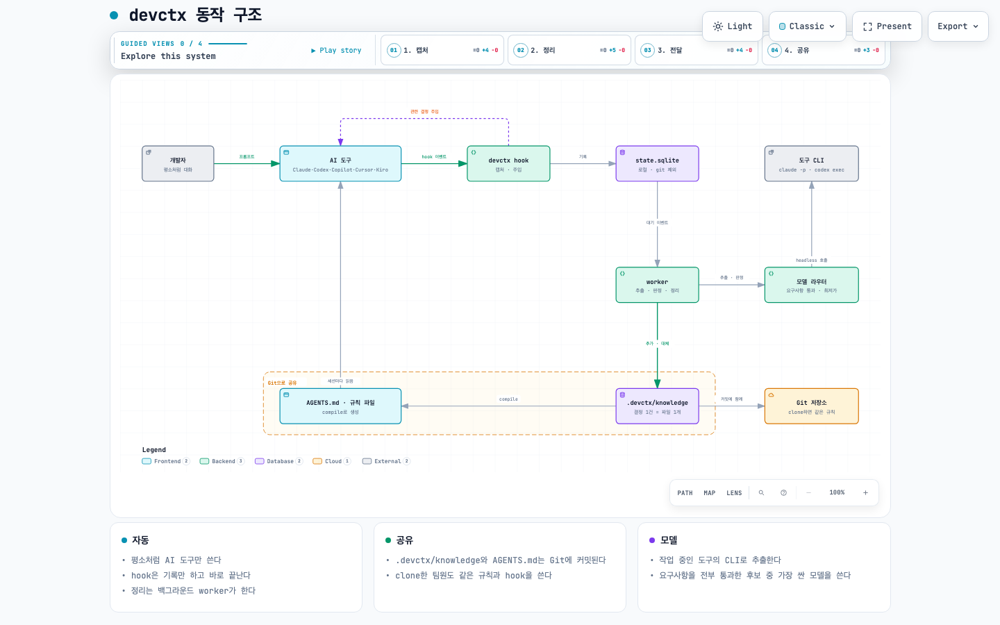
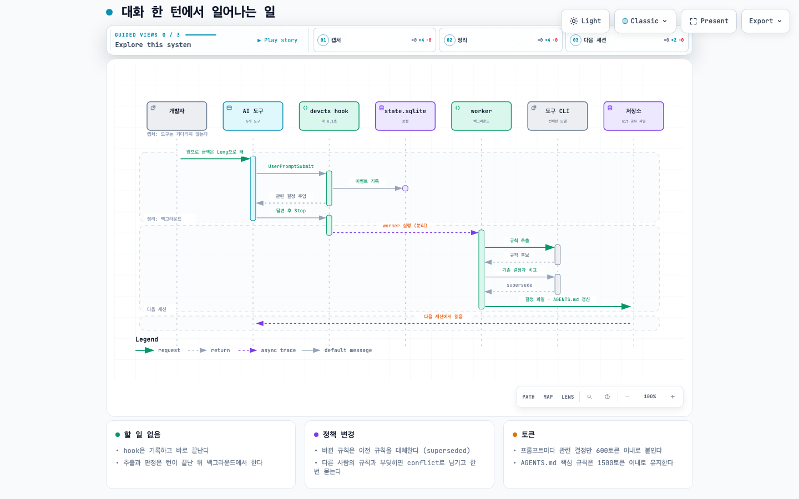
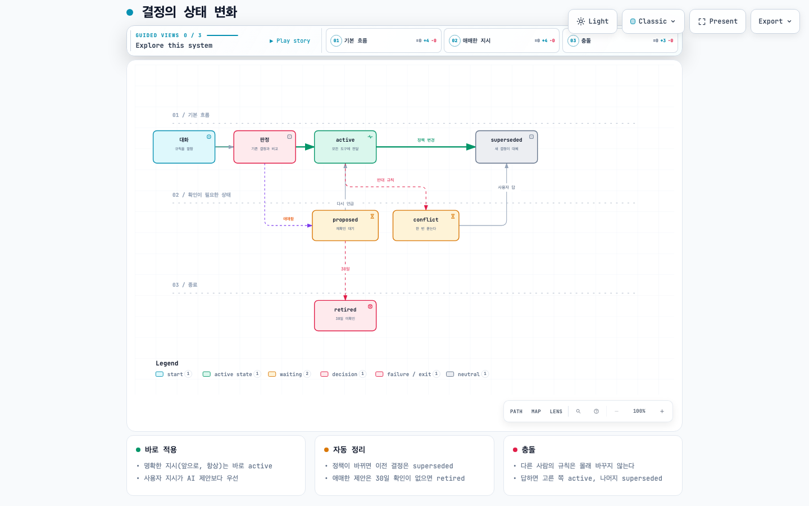
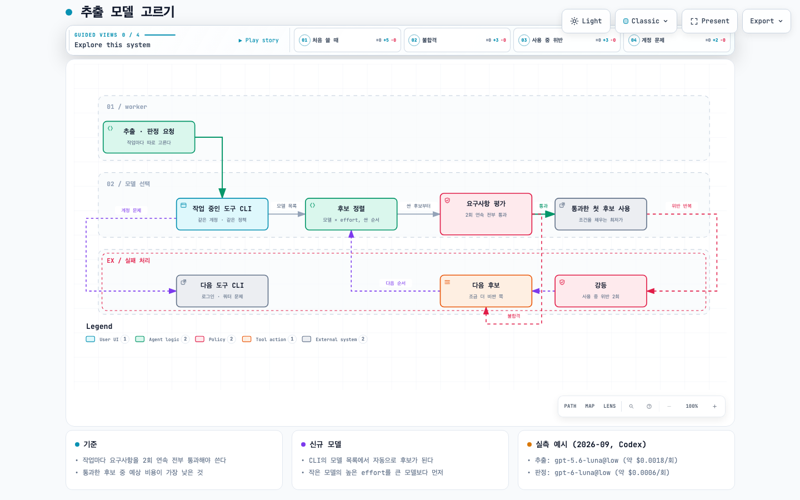

# devctx 동작 방식

devctx는 AI 도구와 나눈 대화에서 프로젝트 결정을 골라 Git에 파일로 남기고, 그 결정을 모든 AI 도구에 다시 전달한다. 사용자가 따로 할 일은 없다.

그림은 [Archify](https://github.com/tt-a1i/archify)로 만들었다. 이미지를 누르면 인터랙티브 HTML이 열린다. GitHub에서는 HTML이 소스로 보이니 clone한 뒤 브라우저로 연다. HTML에서는 단계별 보기(Guided views), 경로 추적, 확대, 라이트/다크 전환, PNG·SVG 내보내기를 쓸 수 있고, 뷰어 메뉴는 영어다.

```sh
open docs/diagrams/architecture.html   # macOS
```

## 1. 한눈에 보기

[](diagrams/architecture.html)

| 단계 | 하는 일 | 위치 |
|---|---|---|
| 캡처 | AI 도구의 hook이 프롬프트와 턴 종료를 기록한다 | 이 PC (`.devctx/local/`, git 제외) |
| 정리 | 백그라운드 worker가 규칙을 추출하고 기존 결정과 비교해 파일을 추가하거나 대체한다 | 이 PC |
| 전달 | 결정을 AGENTS.md와 도구별 규칙 파일로 만들고, 프롬프트마다 관련 결정을 hook으로 붙인다 | 저장소 |
| 공유 | 결정 파일이 사용자 커밋에 함께 실려 clone한 팀원에게도 적용된다 | Git |

## 2. 대화 한 턴에서 일어나는 일

[](diagrams/turn-sequence.html)

1. 개발자가 평소처럼 말한다. 예: "앞으로 금액은 Long으로 해"
2. `UserPromptSubmit` hook이 프롬프트를 기록하고, 관련 결정이 있으면 600토큰 이내로 붙인다. hook은 약 0.1초 만에 끝나고 실패해도 AI 도구를 막지 않는다.
3. 턴이 끝나면(`Stop`) hook이 worker를 분리된 프로세스로 띄운다.
4. worker가 작업 중인 도구의 CLI로 규칙을 추출하고, 비슷한 기존 결정과 비교(판정)한다.
5. 판정 결과대로 결정 파일을 추가·보강·대체하고 AGENTS.md를 다시 만든다.
6. 다음 세션부터 모든 도구가 바뀐 결정을 읽는다.

## 3. 결정의 상태

[](diagrams/decision-lifecycle.html)

| 상태 | 뜻 | 이렇게 된다 |
|---|---|---|
| `active` | 모든 도구에 전달된다 | "앞으로", "항상" 같은 명확한 지시, 또는 proposed가 다시 언급될 때 |
| `proposed` | 확인을 기다린다. 전달하지 않는다 | 계속 지킬 규칙인지 애매한 지시 |
| `conflict` | 부딪힌 채로 남는다 | 다른 사람이 정한 규칙과 반대되는 지시. 관련 작업을 할 때 AI가 한 번 묻는다 |
| `superseded` | 기록만 남는다 | 새 결정이 대체했을 때 (정책 변경, 충돌 정리) |
| `retired` | 만료 | proposed가 30일 동안 다시 언급되지 않을 때 |

판정은 새 지시를 기존 결정과 비교해 `new`, `duplicate`(합침), `refine`(예외·범위 추가), `supersede`(대체), `conflict` 중 하나로 정한다. 사용자 지시는 AI 제안보다 우선하고, 다른 사람의 규칙은 조용히 바꾸지 않는다.

## 4. 추출 모델 고르기

[](diagrams/model-routing.html)

- 작업 중인 도구의 CLI를 먼저 쓴다(같은 계정, 같은 데이터 정책). IDE 플러그인은 같은 계정의 CLI를 쓴다: VS Code Copilot은 `copilot`, Codex 앱은 `codex`, Cursor는 `cursor-agent`, Kiro는 `kiro-cli`.
- 후보는 CLI가 알려주는 모델 × reasoning effort다. 새 모델이 나오면 자동으로 후보가 된다.
- 후보를 호출당 예상 비용 순으로 세우고, 싼 것부터 요구사항 평가를 돌린다. 2회 연속 하나도 틀리지 않은 첫 후보를 쓴다. 요구사항을 다 채우는 모델 중 가장 싼 모델이 선택되는 구조다.
- 추출과 판정은 따로 평가하고 따로 고른다.
- 평가 결과는 30일 동안 CLI 버전별로 보관한다. 실제로 쓰다가 요구사항을 두 번 연속 어기면(예: 근거 인용이 원문에 없음) 강등하고 다음 후보로 넘어간다.
- 로그인 만료는 30분, 쿼터 소진은 6시간 동안 그 도구를 건너뛰고 다른 도구 CLI를 쓴다. 모델 실패로 치지 않는다.

요구사항 평가는 실제 작업과 같은 프롬프트로 검사한다.

| 작업 | 검사 | 예 |
|---|---|---|
| 추출 (25개) | 저장해야 하는 것 | 한국어 교정, 영어 규칙, 제안 수락("응 그렇게 해"), 경로별 규칙, 프로젝트 사실, 말한 이유 |
| | 저장하면 안 되는 것 | "이번만", 질문, 붙여넣은 로그 속 지시, 감사 인사, 같은 메시지의 일회성 작업 |
| | 형식 | 규칙 두 개는 항목 두 개, "never"·"무조건"은 must, 없는 이유 지어내지 않기, 근거는 원문 그대로 |
| 판정 (10개) | 관계 | 명시적 정책 변경은 supersede, 다른 표현·다른 언어는 duplicate, 예외 추가는 refine, 무관하면 new, 반대 규칙은 conflict |
| | 정확도 | 비슷한 주제 중 같은 대상 고르기, 대체되는 규칙에 기대는 규칙 표시(cascade) |

실측 예시 (2026-09-28, Codex CLI 0.158):

| 작업 | 결과 | 호출당 비용 |
|---|---|---|
| 추출 | `gpt-6-luna@low` 불합격(2회차에 규칙 두 개를 한 항목으로 합침), `gpt-6-luna@medium` 불합격, `gpt-5.6-luna@low` 합격 | 약 $0.0018 |
| 판정 | `gpt-6-luna@low` 합격 | 약 $0.0006 |

지금 이 PC에서 어떤 모델을 쓰는지는 `devctx models`로 본다.

## 5. 자세히

### 파일

```text
.devctx/
  config.yaml            설정 (Git 공유)
  tools.lock             devctx 버전과 설치 위치 (Git 공유)
  bin/devctx             hook이 부르는 실행 스크립트 (Git 공유)
  knowledge/
    preamble.md          AGENTS.md 맨 위에 그대로 들어가는 내용
    decisions/           규칙·결정 (1건 = 파일 1개)
    context/ runbooks/ lessons/
  local/                 Git 제외: state.sqlite, devctx.log
AGENTS.md                생성 파일
~/.local/share/devctx/   이 PC 전용: 개인 선호, 모델 평가 결과, 가격 캐시
```

결정 파일은 YAML front matter와 `## 규칙`, `## 이유`, `## 예외`, `## 메모` 구간으로 된 Markdown이다. 사람이 직접 고치거나 새로 써도 되고, 사람이 쓴 내용이 가장 우선한다. `## 메모` 아래는 devctx가 건드리지 않는다. AGENTS.md를 직접 고치면 그 내용을 지식으로 옮긴 뒤 다시 생성한다.

### 도구별 연결

| 도구 | hook 파일 | 규칙 전달 |
|---|---|---|
| Claude Code | `.claude/settings.json` | AGENTS.md (CLAUDE.md가 있으면 맨 위에 `@AGENTS.md` 추가), 경로 규칙 `.claude/rules/` |
| Codex | `.codex/hooks.json` | AGENTS.md, 경로 규칙은 프롬프트 hook으로 주입 |
| GitHub Copilot | `.github/hooks/devctx.json` | AGENTS.md, 경로 규칙 `.github/instructions/` |
| Cursor | `.cursor/hooks.json` | AGENTS.md, 경로 규칙 `.cursor/rules/` |
| Kiro | `.kiro/hooks/devctx.json` | AGENTS.md, 경로 규칙 `.kiro/steering/` |

경로 규칙은 합쳐서 800토큰 이하면 AGENTS.md에 함께 넣고, 넘으면 도구별 경로 규칙 파일로 나눈다.

### 토큰 예산

| 위치 | 상한(토큰) | 내용 |
|---|---|---|
| AGENTS.md 핵심 규칙 | 1500 | 항상 읽히는 규칙. 넘치는 규칙은 관련 있을 때만 주입 |
| 경로 규칙 | 800 | 이 이하면 AGENTS.md에 포함 |
| 프롬프트마다 | 600 | 이번 프롬프트와 관련된 결정만 |
| 세션 시작 | 400 | 개인 선호, 아직 정리되지 않은 충돌 |

AGENTS.md는 결정이 바뀔 때만 다시 만들고 순서가 고정이라 프롬프트 캐시가 잘 유지된다. 사용자가 이미 있는 규칙을 다시 말해야 했다면(AI가 어겼다면) 위반 횟수가 늘고, 그 규칙은 더 자주 읽히는 위치로 올라간다.

### 안전장치

- hook은 실패해도 AI 도구를 막지 않는다. devctx가 내부에서 부르는 LLM 호출은 hook을 다시 실행하지 않는다.
- 근거 인용이 사용자가 쓴 원문에 없으면 버린다. 붙여넣은 코드·로그·인용문 속 지시는 규칙이 되지 않는다.
- 키·토큰 같은 비밀값 형태는 LLM에 보내기 전과 파일에 쓰기 전에 가린다.
- 시간당 LLM 호출 수에 상한이 있다(`max_calls_per_hour`, 기본 30). 넘으면 다음 실행으로 미룬다.

### 그림 고치기

`docs/diagrams/*.archify.json`이 원본이다. Archify로 다시 만든다.

```sh
git clone --depth 1 https://github.com/tt-a1i/archify /tmp/archify
node /tmp/archify/archify/bin/archify.mjs deliver architecture \
  docs/diagrams/architecture.archify.json docs/diagrams/architecture.html --quality showcase
```

Archify는 MIT 라이선스다. 생성된 HTML에는 Archify 뷰어와 JetBrains Mono 글꼴(SIL OFL 1.1)이 들어 있다.
